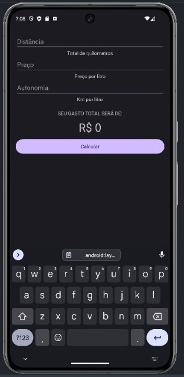

## Programa Consumo viagem
### Calcule o consumo de gasolina do seu percuso com base em:
- Tamanho do percurso
- Preço da Gasolina
- Autonomia do Veículo
### Tecnologias Utilizadas:
- Kotlin
- Android Studio
### Imagem do projeto:

